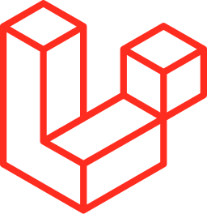
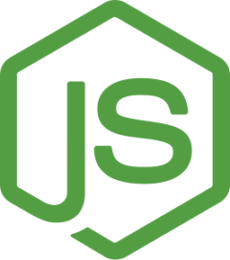
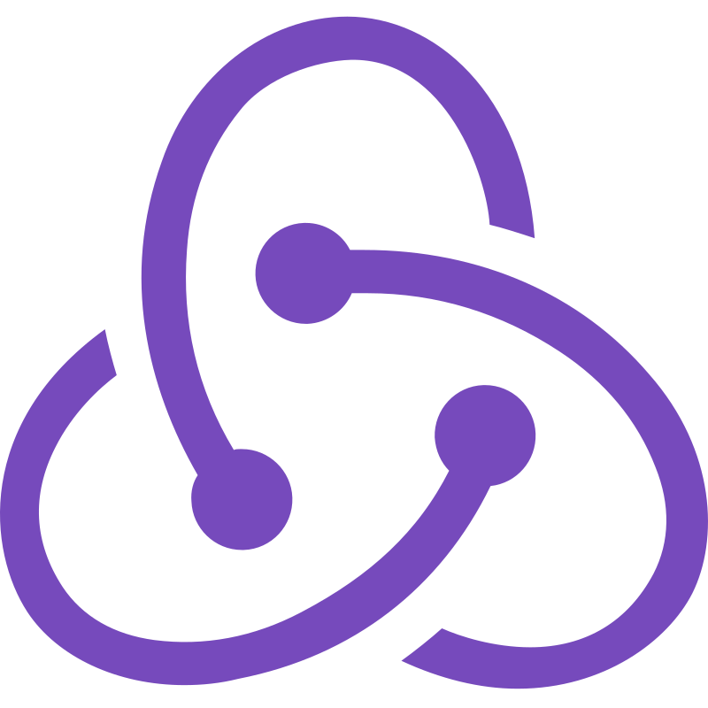

<h1 align="center">Hello there, 👋🏻 I'm Manu!</h1>
<h3 align="center">I'm a Fullstack Software Engineer.</h3>

- 🔭 I’m currently looking for new oportunities!.
- 🌱 I’m currently studying a *Bachelor's Degree* in **Applied Technology** at **Brigham Young University-Idaho**.
- ✨ I'm currently learning **Rust** and **C#**.
- 📄 Know about my experiences on my [Portfolio](https://manugonzalez-portfolio.netlify.app/).

I am a passionate developer user-oriented solutions with **4 years of experience** in several languages and technologies, worked on projects for international companies and different teams. 

    I am good in teamwork using agile methodologies to plan, organize myself and adapt me to different projects. I love challenges and learn modern technologies to push me to improve myself. 

I'm a proactive person, with a strong sense of responsibility and commitment, always looking for the best solution to the problems, and I'm always open to new ideas and suggestions.

    Currently, I'm studying a Bachelor's Degree in Applied Technology at Brigham Young University-Idaho, and ending a few courses in EducacionIT, a Online technical school based in Argentina.

    I talk Spanish native, Portuguese intermediate and <a href="https://cert.efset.org/ivF92R" target="_blank" class="text-bold underline underline-offset-2" style="color: #fec900">English C1 (Advanced)</a>, with a good communication and writing skills.

### Contact with me!

<h3 align="left">Languages and Tools:</h3>

 
  
  
  
  
  
  
  
  
  
  
  
  
  
  

